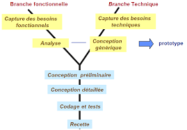
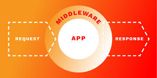

## **Analysis & Design**

- Presented by: SUIRITA Fahd
- Framed by: ESSARRAJ Fouad

---

### **1. Introduction**

---

### **2-2TUP Methodology:**

---

### **3. Planning:**

<table style="font-size: 42px" >
  <tr>
    <th></th>
    <th>1</th>
    <th>2</th>
    <th>3</th>
  </tr>
  <tr>
    <td>Monday</td>
    <td>-</td>
    <td>-</td>
    <td>-</td>
  </tr>
  <tr>
    <td>Tuesday</td>
    <td>-</td>
    <td>-</td>
    <td>Tuto-1</td>
  </tr>
  <tr>
    <td>Wednesday</td>
    <td>Tuto-2</td>
    <td>Tuto-3</td>
    <td>Tuto-3</td>
  </tr>
  <tr>
    <td>Thursday</td>
    <td>Tuto-4</td>
    <td>Prototype</td>
    <td>Prototype</td>
  </tr>
  <tr>
    <td>Friday</td>
    <td>realisation</td>
    <td>realisation</td>
    <td>-</td>
  </tr>
</table>

---

### **4. Learning:**

|||

### **4. Learning:**

---

### **5. Prototype:**

- view articles
- add article
- delete article

---

### **6. Realisation:**

---

### **7. Conclusion:**
